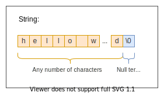
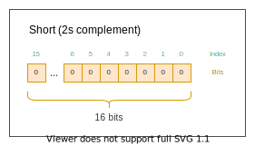
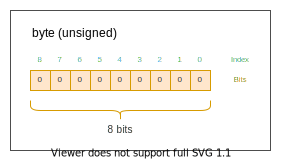

> Copyright 2021 Skyfighter64
>
>   Licensed under the Apache License, Version 2.0 (the "License");
   you may not use this file except in compliance with the License.
   You may obtain a copy of the License at
>
>       http://www.apache.org/licenses/LICENSE-2.0
>
>   Unless required by applicable law or agreed to in writing, software
   distributed under the License is distributed on an "AS IS" BASIS,
   WITHOUT WARRANTIES OR CONDITIONS OF ANY KIND, either express or implied.
   See the License for the specific language governing permissions and
   limitations under the License.


--------------------------------------------------------------------------------

# ALUP - Arduino LED USB Protocol (name may change)

__Version: 0.2__


## Description

The ALUP (Arduino LED USB Protocol, name may change) is a protocol for transmission of RGB data.
It can be used to let almost any device control addressable LED strips.


This document defines the protocol itself.
If you just want to use it, see:
[ALUP Implementations](#Implementations_link) and [Projects using ALUP](#Projects_link).

## Table of contents
- [Overview](#Overview_link)
- [Features](#Features_link)
- [Requirements](#Requirements_link)
- [Terminology](#Terminology_link)
- [Protocol Flow](#Protocol_Flow_link)
  - [Connecting](#Connecting_link)
  - [Data Transmission](#Data_Transmission_link)
  - [Disconnecting](#Disconnecting_link)
- [Definitions](#Definitions_link)
  - [Data Types](#Data_Types_link)
  - [Constants](#Constants_link)
  - [Configuration Format](#Configuration_Format_link)
  - [Frame Format](#Frame_Format_link)
  - [Commands](#Commands_link)

## <a name="Overview_link"></a> Overview


#### Example Usecase:
You want to control addressable LED strips using your computer, but can't because it has no way to connect to the LEDs directly, like GPIO pins, whereas an arduino
can control addressable LEDs, but lacks features or performance which are needed.

This is where this protocol comes in.

The ALUP describes a way how the RGB data gets from the PC (Sender) to the Microcontroller (Receiver) over any kind of connection like USB or Wi-Fi, which then applies the RGB values to the LEDs. This makes it possible for the PC to control the addressable LEDs indirectly.    


## Features
- __Flexible:__ Almost any connection such as USB or Wi-Fi can be used.

- __Customizable:__ Programs can add custom configuration values and trigger pre-written scripts on the Receiver.

## Requirements
A list of requirements for the protocol.


#### Hardware requirements:
The **protocol** has the following hardware requirements:

- Sender
    - e.g. a Windows PC

- Receiver
    - Has to be able to control addressable LEDs
    - e.g. Arduino, ESP32, ...

- Connection between devices
    - e.g. USB, UART, Wi-Fi, Bluetooth etc.

#### Connection Requirements:
The ALUP has built in congestion control, but nothing else. Therefore, it has the following requirements for the connection:
- in-order packet transmission
- lossless transmission
  - Depending on the implementation, there may also be lossy transmission, as long as only full [frames](#Frame_link) are lost, to decrease latency


## Terminology
This section gives a list of the most important terms used within this protocol to better understand this document.

 __Term__ | Example | Description
 -----|---------|-------------
 __Color data__ | `R:255, B:123, G:0` | One or multiple triplets of 8bit color values, represented in the RGB format. For more, see [Color Data](#Color_Data_link)
 __Sender (formerly Master Device)__ | PC, Smartphone | The device which __sends__ RGB data to the Receiver
 __Receiving Device (formerly Slave Device)__ | Arduino, ESP8266 | The device which __receives__ the RGB data from the Sender and applies it to the LEDs.
 __(Physical) Connection__ | USB, Wi-Fi  | The connection between the __Sender__ and the __Receiver__ (Includes the entire protocol stack for data transmission).
  |  |
 __Frame__ | - | A set of data which gets sent from the Sender to the Receiver. Consists of a __frame header__  and a __frame body__. For more, see [Frame](#Frame_link).
 __Frame Header__ | - | The part of the frame containing special information. For more, see [Frame](#Frame_link).
 __Frame Body__ | - | The part of the frame which contains RGB data. For more, see [Frame](#Frame_link).
  |  |
 __Command__ | - | A field in the frame header. See [Commands](#Commands_link)

------------------------------

## Protocol Flow
This section states how the protocol works in detail by explaining what each device does during each
of the 3 processes. Those processes are:

- [Connecting](#Connecting_link)
- [Data Transmission](#Data_Transmission_link)
- [Disconnecting](#Disconnecting_link)


### Protocol Flow Overview:
A quick overview of the protocol workflow.
When two devices get connected via the physical connection, they first establish a connection and share some important
configuration data like how many LEDs are connected to the Receiver.

If this happened successfully, the Sender sends data frames for the LEDs until it disconnects, or the physical connection is interrupted.


:information_source: All timeout values are defined by the protocol implementation itself.


### <a name="Connecting_link"></a>Connecting

Before sending any [Color data](#Color_Data_link), both devices need to be connected and configured. This connection process consists of 3 Steps:
- [Requesting a connection](#Requesting_A_Connection_link)
- [Exchanging configuration data](#Exchanging_The_Configuration_link)
- [Confirming the configuration data](#Confirming_The_Configuration_link)


----

#### <a name="Requesting_A_Connection_link"></a>Requesting a connection:

##### Receiver:
As soon as the physical connection is established,
the Receiver begins to send a [connection request byte](#Connection_Request_Byte_link) and listens for a [connection acknowledgement byte](#Connection_Acknowledgement_Byte_link) in fixed intervals.
The interval size can be specified by the implementation itself.

Sending [connection request bytes](#Connection_Request_Byte_link) and listening for a
[connection acknowledgement byte](#Connection_Acknowledgement_Byte_link) will not time out and continue indefinitely until a [connection acknowledgement byte](#Connection_Acknowledgement_Byte_link) is received.


##### Sender:
The Sender starts by listening for a single Byte of data containing a [connection request byte](#Connection_Request_Byte_link). When receiving a [connection request byte](#Connection_Request_Byte_link), the Sender prepares to receive the
[Configuration](#Configuration_Format_link) next and sends a [connection acknowledgement byte](#Connection_Acknowledgement_Byte_link) back to the Receiver as soon as it is ready to
receive the configuration.

Listening for a connection request byte [connection request byte](#Connection_Request_Byte_link) may time out, but can also continue until one was received. This behavior can be specified by the implementation of the Sender.


----
#### <a name="Exchanging_The_Configuration_link"></a>Exchanging the configuration:

##### Receiver:
When receiving the [connection acknowledgement](#Connection_Acknowledgement_Byte_link), the Receiver stops sending [connection request bytes](#Connection_Request_Byte_link) and listening for [connection acknowledgements](#Connection_Acknowledgement_Byte_link).

It sends the configuration in the defined [Configuration Format](#Configuration_Format_link) and waits for either a [configuration acknowledgement byte](#Configuration_Acknowledgement_Byte_link) or a  [configuration error byte](#Configuration_Error_Byte_link).


##### Sender:
After sending the connection acknowledgement, the Sender starts listening for the  [configuration start byte](#Configuration_Start_Byte_link).\
This byte marks the start of the configuration.

When receiving the start byte, the Sender proceeds by reading in the configuration as defined in the [Configuration Format](#Configuration_Format_link).

If there was no configuration start byte received within a certain timeout, the Sender assumes that the
connection is dead and aborts the connection process.

When receiving the configuration, the Sender initializes everything necessary using the received configuration. As soon as the initialization
is finished it sends an [configuration acknowledgement byte](#Configuration_Acknowledgement_Byte_link), indicating that it applied the configuration successfully.

If the configuration could not be applied, it sends an [configuration error byte](#Configuration_Error_Byte_link) to the Receiver indicating that there was
a problem while applying the configuration. Reasons for sending a [configuration error byte](#Configuration_Error_Byte_link) are:

- incompatible protocol versions
- malformed configuration received
- configuration contains invalid values
- an error occurred while applying the configuration


#### <a name="Confirming_The_Configuration_link"></a>Confirming the configuration:

##### Receiver:
If a [configuration acknowledgement byte](#Configuration_Acknowledgement_Byte_link) is received, the Receiver sends an configuration acknowledgement back indicating that
it is ready to receive Data and moves on to [Data Transmission](#Data_Transmission_link).

If the Sender could not apply the configuration, a [configuration error byte](#Configuration_Error_Byte_link) will be received.
In this case, the Receiver aborts the "connection" process and
waits for a new connection attempt by starting at the [beginning](#Requesting_A_Connection_link) and sending new connection requests.

If no configuration acknowledgement byte or configuration error byte was received within a certain timeout, the Receiver assumes that the
connection is dead and aborts the "connection" process. It then starts at the [beginning](#Requesting_A_Connection_link) by sending new connection requests.


##### Sender:
After sending a [configuration acknowledgement byte](#Configuration_Acknowledgement_Byte_link) to confirm the configuration, the Sender listens for a configuration acknowledgement byte from the Receiver.


When the Sender receives a [configuration acknowledgement byte](#Configuration_Acknowledgement_Byte_link), the connection is established successfully and the
devices are ready to move on to [Data Transmission](#Data_Transmission_link).


----------------------------------------------------------------


### <a name="Data_Transmission_link"></a>Data transmission:
The following text and images will describe the process of sending and receiving [frames](#Frame_link) on both devices.

The data transmission process has 3 steps:

- [Sending](#Sending_Frames_link)/[Receiving](#Receiving_Frames_link) a frame
- Applying the frame to the LEDs
- Frame Acknowledgement


#### <a name="Receiving_Frames_link"></a>Receiving Frames
##### Receiver:
Receiving frames consists of 4 steps:
- Receiving frame header
- Receiving frame body
- Validating frame body size
- Acknowledging frame


As soon as the Receiver sent its Configuration acknowledgement, it gets ready to receive frames in the [frame format](#Frame_link) by waiting for a [Frame Header](#Frame_Header_link).

Waiting for a header continues indefinitely until a header is received or the underlying connection either disconnects or times out. This means that data transmission never times out on the side of the Receiver.

When receiving the fixed-size header, the Receiver reads the frame body size from the header and receives the frame body using this size value.

 It then checks the
[Command Byte](#Command_Byte_link) of the header and executes the given command.

In case of the default command `None`, the Receiver checks the body size and body offset to be valid.

#### Checking the frame body size:

The frame body consists of byte triplets which represent RGB values, it's length therefore always has to be a multiple of 3.

The Receiver checks this for the frame body size value from the header.


If it's not a multiple of 3, the Receiver sends a [`frame error byte`](#Frame_Error_Byte_link) to the Sender and deletes the received frame body.

If the Frame data is less than or equal to the `number of LEDs * 3`, the Receiver applies the [Color data](#Color_Data_link) to the LEDs and sends a
Frame Acknowledgement Byte to the Sender to indicate for one, that the data was applied and
it is ready to receive the next Frame, and also indicating that the device was not disconnected.

If the Frame data is more than the (number of LEDs * 3), the Receiver discards all of the data from this frame body and sends
a Frame Error Byte to the Sender.

This has to be done in order to prevent desynchronisation of the data stream, in which case all of the incoming data afterwards would be invalid
and the connection would have to be shut down and reestablished manually.


It now returns to the start of the Data Transmission to receive the next frame. This continues indefinitely until a `disconnect` protocol command
gets received.


#### Applying the frame body:

If the frame body size and frame body offset checks passed, the Receiver applies the frame body to the LEDs with the following rules:

  - All LEDs are set to the color as specified in the body in the [RGB format](#Color_Data_link) if the command is `None` or `Clear` or any other command unless stated otherwise.

  - If there is no color specified for an LED, it shall remain unchanged when the command is `None`. When the command is `Clear`, all non-specified LEDs are set to black (R = 0, G = 0, B = 0).

  - The first LED index is the value of [Frame Body Offset](#Frame_Body_Offset_link). If the first Index exceeds the length of the LED strip, continue without applying LEDs.

  - The last LED index is `Frame Body Offset + (Frame Body Size / 3)`. If the Frame Body data exceeds the length of the LED strip, all exceeding values are ignored.


-------------------------------

#### <a name="Sending_Frames_link"></a>Sending Frames
##### Sender:
As soon as the Sender receives the Configuration acknowledgement from the Receiver, it sends [`Data Frames`](#Frame_link) to the Receiver in undefined intervals.

The [frame header](#Frame_Header_link) and [body](#Frame_Body_link) are constructed as defined considering the following rules:

- All rules stated for applying the frame body when [receiving a frame](#Receiving_Frames_link)

The built frame gets appended at the end of the header and sent to the Receiver.


The Sender then waits for a [frame acknowledgement](#Frame_Acknowledgement_Byte_link) or [frame error](#Frame_Error_Byte_link)

If a [frame acknowledgement](#Frame_Acknowledgement_Byte_link) or [frame error](#Frame_Error_Byte_link) is received, the next frame can be sent.

While a [frame acknowledgement](#Frame_Acknowledgement_Byte_link) indicates a successful operation, a [frame error](#Frame_Error_Byte_link) indicates an issue with the frame. This can be:

- For `None` and `Clear` commands:
    - The body size is no multiple of 3
- For any other commands, see command definition.


If no [frame acknowledgement](#Frame_Acknowledgement_Byte_link) or [frame error](#Frame_Error_Byte_link) is received within a specified time interval, the connection is considered dead and can be terminated.


----------------------------------------------------------------------------------------------

### <a name="Disconnecting_link"></a> Disconnecting:


##### Sender:

When the Sender wants to disconnect, it sends a frame with a [`disconnect command`](#Protocol_Commands_link) to the Receiver and then disconnects
his side of the connection by invalidating all connection relevant values and disconnecting all underlying protocols.


##### Receiver:

Upon receiving a frame with a [`disconnect command`](#Protocol_Commands_link) inside the frame header, the Receiver treats the connection as dead, invalidates all connection relevant values, and disconnects the underlying connection on his side if needed. A final [frame acknowledgement](#Frame_Acknowledgement_Byte_link) is sent to confirm the disconnect.

When the Receiver wants to initiate disconnecting, it can only do so indirectly by
stopping to respond to frames with frame acknowledgements or frame errors. This causes a time out on the Sender.


-----------------------------------------------------------------

## <a name="Definitions_link"></a>Definitions

This section contains definitions and constants of the protocol

### <a name="Data_Types_link"></a>Data Types:
All mentions of the data types within this documentation refer to the definitions below if not stated otherwise.

#### <a name="String_link"></a>String:
A string is a combination of UTF-8 encoded characters followed by a null byte used as terminator.
String data has a dynamic length; The end of a string is marked with a Null byte (`0x00`) as a terminator.

When sending String data, send a Null byte (`0x00`) afterwards if it is not done by the used programming language itself.




#### <a name="Integer_link"></a>Integer:
An integer number is a 32-bit 2s-compliment number.


#### Long:
A long is a 64bit 2s-compliment number.


#### Short:
A short is a 16bit 2s-compliment number.



#### <a name="Byte_link"></a>Byte:
A byte is an 8bit unsigned number ranging from 0 to 255.



---

:information_source: Notes:
- while most architectures do use those definitions, depending on the board, the architecture of the Arduino may use 16-bit numbers as integer.
Therefore, when you want to send integer data, you may actually have to use variables of the type long (32bit-integer) on the Arduino
and int (32bit-integer) on the Sender's system. At the end, the actual bit length of the types has to match.

- Strings may use a null terminator internally, but when sending strings, the null terminator may be cut off. It is Therefore
important to ensure a null terminator is also sent so the receiving device does know the end of the string.

--------------------------------------------------------------------------------


### <a name="Constants_link"></a>Constants:
This section describes all relevant constants

Name | Value | Description
:--- | --- | ---
<a name="Connection_Request_Byte_link"></a>__Connection Request Byte__ | 255 (base 10) |  Byte value used by the Receiver to request a new connection.
<a name="Connection_Acknowledgement_Byte_link"></a>__Connection Acknowledgement Byte__ | 254 (base 10) | Byte value used by the Sender to accept a connection request.
<a name="Configuration_Start_Byte_link"></a>__Configuration Start Byte:__ | 253 (base 10) | Byte value indicating the start of the configuration
<a name="Configuration_Acknowledgement_Byte_link"></a>__Configuration Acknowledgement Byte__ | 252 (base 10) | Byte value sent by the Sender to indicate that the configuration was applied and received successfully
<a name="Configuration_Error_Byte_link"></a>__Configuration Error Byte__ | 251 (base 10) | Byte value indicating that the that the Sender could not receive or apply the configuration correctly
<a name="Frame_Acknowledgement_Byte_link"></a>__Frame Acknowledgement Byte__ | 250 (base 10) | Byte value sent by the Receiver to indicate that a Frame was received and applied successfully
<a name="Frame_Error_Byte_link"></a>__Frame Error Byte__ | 249 (base 10) |Byte value indicating that a Frame could not be received or applied successfully.<br/> Caused by: <ul> <li>Invalid [`frame body size`](#Frame_Body_Size_link)</li><li>Invalid [`frame body offset`](#Frame_Body_Offset_link)</li></ul>

--------------------------------------------------------------------------------

### <a name="#Configuration_Format_link"></a>Configuration Format:
This section describes the format of the configuration used while connecting.

The configuration has to be in the following format:
```
 0                   1 1 1 1 1 1
 0 1 2 3 4 5 6 7 8 9 0 1 2 3 4 5
+-+-+-+-+-+-+-+-+
|   253 (CSB)   |               
+-+-+-+-+-+-+-+-+-+-+-+-+-+-+-+-+
/                               /
/        Protocol Version       /
/                               /
+-+-+-+-+-+-+-+-+-+-+-+-+-+-+-+-+
/                               /
/          Device Name          /
/                               /
+-+-+-+-+-+-+-+-+-+-+-+-+-+-+-+-+
|                               |
+           LED Count           +
|                               |
+-+-+-+-+-+-+-+-+-+-+-+-+-+-+-+-+
|                               |
+           Data Pin            +
|                               |
+-+-+-+-+-+-+-+-+-+-+-+-+-+-+-+-+
|                               |
+           Clock Pin           +
|                               |
+-+-+-+-+-+-+-+-+-+-+-+-+-+-+-+-+
/                               /
/          Extra Values         /
/                               /
+-+-+-+-+-+-+-+-+-+-+-+-+-+-+-+-+
```


#### <a name="Configuration_Values_link"></a>Configuration Values:

<a name="Configuration_Start_Byte_link"></a>
__Configuration Start Byte (CSB):__
  - Type: [Byte](#Byte_link)
    - Constant Value: 253 (base 10)
  - Size: 1 Byte
  - Description: A byte marking the start of the configuration. It is followed by the configuration values according to the protocol configuration format.


<a name="Protocol_Version_link"></a>
__Protocol Version:__
  - Type: [String](#String_link (UTF-8)
  - Size: Dynamic
  - Description: the protocol version used by the Receiver
  - Valid values:
      - `"0.1 (internal)"`
      - `"0.2"`

<a name="Device_Name_link"></a>
__Device Name:__
  - Type: [String](#String_link) (UTF-8)
  - Size: Dynamic
  - Description: A descriptive name of the Receiver; Does not have to be unique
  - Valid values: Any [String](#String_link) value

<a name="Number_Of_Leds_link"></a>
__LED Count:__
  - Type: [Integer](#Integer_link)
  - Size: 4 Bytes
  - Description: The number of LEDs on the addressable LED strip connected to the Receiver
  - Valid values: Any positive Integer value or 0

<a name="Data_Pin_link"></a>
__Data pin:__
  - Type: [Integer](#Integer_link)
  - Size: 4 Bytes
  - Description: The digital pin at which the data line of the addressable LED strip is connected
  - Valid values:
    - A positive Integer value; Should be a valid Data pin of the connected Receiver (e.g. Arduino)
    - `0` if not applicable  

<a name="Clock_pin_link"></a>
__Clock pin:__
  - Type: [Integer](#Integer_link)
  - Size: 4 Bytes
  - Description: The digital pin at which the clock line of the addressable LED strip is connected.
  - Valid values:
    - A positive Integer value; Should be a valid Data pin of the connected Receiver (e.g. Arduino)
    - `0` if not applicable

<a name="Extra_Values_link"></a>
__Extra Values:__
  - Type: [String](#String_link) (UTF-8)
  - Size: Dynamic
  - Description: A string containing user-customizable configuration values; This can be used by anyone to send additional configuration values, but may be ignored depending on the implementation.
  - Valid values: Any [String](#String_link) value


--------------------------------------------------------------------------------


### <a name="Frame_Format_link"></a>Frame:
A frame consists of 2 parts:\
The frame header and the frame body.

__Frame:__
```
+-+-+-+-+-+-+-+-+-+-+-+-+-+-+-+-+
|            Header             |
+-+-+-+-+-+-+-+-+-+-+-+-+-+-+-+-+
|                               |
/                               /
/             Body              /
|                               |
+-+-+-+-+-+-+-+-+-+-+-+-+-+-+-+-+

```

Those parts are structured as stated below:

### <a name="Frame_Header_link"></a>Frame Header:
The frame header consists of 10 bytes:

__Frame Header:__
```
0                   1 1 1 1 1 1
0 1 2 3 4 5 6 7 8 9 0 1 2 3 4 5
+-+-+-+-+-+-+-+-+-+-+-+-+-+-+-+-+
|                               |
+        Frame Body Size        +
|                               |
+-+-+-+-+-+-+-+-+-+-+-+-+-+-+-+-+
|                               |
+       Frame Body Offset       +
|                               |
+-+-+-+-+-+-+-+-+-+-+-+-+-+-+-+-+
|    COMMAND    |     Unused    |
+-+-+-+-+-+-+-+-+-+-+-+-+-+-+-+-+

```
__Content descriptions:__

<a name="Frame_Body_Size_link"></a>
__Frame Body Size__
  - Type: [Integer](#Integer_link)
  - Size: 4 Bytes
  - Description: The size of the upcoming frame body in bytes
  - Valid values:
    - A positive Number; Has to be a multiple of 3
    - 0 when there is no body

:warning: Causes a frame error to be sent if invalid.

<a name="Frame_Body_Offset_link"></a>
__Frame Body Offset__
  - Type: [Integer](#Integer_link)
  - Size: 4 Bytes
  - Description: The offset of the data from the first LED
  - Valid values: A positive number or 0

:warning: Causes a frame error to be sent if invalid.

<a name="Command_Byte_link"></a>
__Command__
  - Type: Byte
  - Size: 1 Byte
  - Description: A byte value specifying a command to be executed before the upcoming [Color data](#Color_Data_link) gets applied or how to interpret the frame body.
  For more, see [commands](#Commands_link).
  - Valid values: Any byte value (0-255)


__Byte: 9__
  - Currently unused, reserved for future use.

### <a name="Color_Data_link"></a>Color data:

One or multiple sets of 3 bytes representing the Red, Green and Blue color value each within a range of 0-255 in binary representation.
```
0                   1 1 1 1 1 1 1 1 1 1 2 2 2 2
0 1 2 3 4 5 6 7 8 9 0 1 2 3 4 5 6 7 8 9 0 1 2 3
+-+-+-+-+-+-+-+-+-+-+-+-+-+-+-+-+-+-+-+-+-+-+-+-+
|       R       |       G       |       B       |
+-+-+-+-+-+-+-+-+-+-+-+-+-+-+-+-+-+-+-+-+-+-+-+-+
```


### <a name="Frame_Body_link"></a>Frame Body:
The frame body consists multiple [color data](#Color_Data_link) fields. Its size in bytes is specified in the [`Frame Body size`](#Frame_Body_Size_link) header value.


__Frame Body Structure:__
```
 0                   1 1 1 1 1 1 1 1 1 1 2 2 2 2
 0 1 2 3 4 5 6 7 8 9 0 1 2 3 4 5 6 7 8 9 0 1 2 3
+-+-+-+-+-+-+-+-+-+-+-+-+-+-+-+-+-+-+-+-+-+-+-+-+
|       R       |       G       |       B       |
+-+-+-+-+-+-+-+-+-+-+-+-+-+-+-+-+-+-+-+-+-+-+-+-+
/                                               /
/                     ...                       /
/                                               /
+-+-+-+-+-+-+-+-+-+-+-+-+-+-+-+-+-+-+-+-+-+-+-+-+
|       R       |       G       |       B       |
+-+-+-+-+-+-+-+-+-+-+-+-+-+-+-+-+-+-+-+-+-+-+-+-+
```

----------------------------------------------------------------------

## <a name="Commands_link"></a>Commands
This sections explains the use of the `Command` header value.

Commands specify an action to execute for the Receiver. This could be an information on how to interpret the contents of the frame body or an execution of predefined code on the Receiver.

As example, the `CLEAR` command specifies that the frame body should be applied to the LED strip but, contrary to the default behavior, all LEDs not set to a color in the body will be set to black.

For another example, the `DISCONNECT` command specifies that the code for disconnecting should be executed. The Frame Body is ignored.

This creates extensibility to a point where everyone can specify custom commands fitting for their projects needs.


List of Commands:

Name   | Value | Description
:---- | ----- | -----------
None | 0  | The default command. Command stating that the [frame body](#Frame_Body_link) should be applied to the LEDs. LEDs not changed by the frame body will remain unchanged.
Clear | 1 | Command setting all LED values to 0 before applying the [frame body](#Frame_Body_link). If the [frame body](#Frame_Body_link) is empty, all LEDs get set to black, if the body contains [Color data](#Color_Data_link), the color data gets applied and all LEDs not changed by the frame body get set to black.
Disconnect | 2 |  Command invoking the [disconnecting](#Disconnecting_link) process.
RESERVED |3 - 7|  Commands reserved for future use.
User Defined | 8 - 255 | Command values with no official use. Intended to be used by anyone to define custom commands.


Some Ideas for custom commands (may be implemented in the future idk):
- Command for 'White' Color frames for RGBW LED strips
- Commands triggering predefined animations
- Command setting static colors
