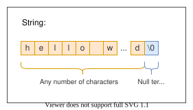
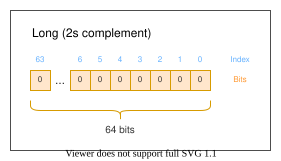
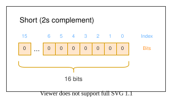
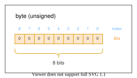

> Copyright 2025 Skyfighter64
>
>   Licensed under the Apache License, Version 2.0 (the "License");
   you may not use this file except in compliance with the License.
   You may obtain a copy of the License at
>
>       http://www.apache.org/licenses/LICENSE-2.0
>
>   Unless required by applicable law or agreed to in writing, software
   distributed under the License is distributed on an "AS IS" BASIS,
   WITHOUT WARRANTIES OR CONDITIONS OF ANY KIND, either express or implied.
   See the License for the specific language governing permissions and
   limitations under the License.


--------------------------------------------------------------------------------

# ALUP - Arduino LED USB Protocol (name may change)

__Version: 0.3__


## Description

The ALUP (Arduino LED USB Protocol, temporary name) is a protocol for transmission of RGB data.
It can be used to let almost any device control addressable LED strips.


This document defines the protocol parameters, constants, data and control flow.\
For reference implementations see:

- [Python-ALUP (Sender)](https://github.com/Skyfighter64/Python-ALUP)
- [Arduino-ALUP (Receiver)](https://github.com/Skyfighter64/Arduino-ALUP)

## Table of contents
- [Overview](#overview)
- [Features](#features)
- [Requirements](#requirements)
- [Terminology](#terminology)
- [Protocol Flow](#protocol-flow)
  - [Connecting](#connecting)
  - [Data Transmission](#data-transmission)
  - [Disconnecting](#disconnecting)
- [Definitions](#definitions)
  - [Data Types](#data-types)
  - [Constants](#constants)
  - [Configuration Format](#configuration-format)
  - [Frame Format](#frame)
  - [Commands](#commands)

## <a name="overview"></a> Overview


#### Example Usecase:
You want to control addressable LED strips using your computer, but can't because it has no way to connect to the LEDs directly, like GPIO pins, whereas an arduino
can control addressable LEDs, but lacks features or performance which are needed.

This is where this protocol comes in.

The ALUP describes a way how the RGB data gets from the PC (Sender) to the Microcontroller (Receiver) over any kind of connection like USB or Wi-Fi, which then applies the RGB values to the LEDs. This makes it possible for the PC to control the addressable LEDs indirectly.    


## Features
- __Connection-Independent:__ Almost any connection such as Serial (USB) or TCP (via Wi-Fi/Ethernet) can be used.

- __Customizable:__ Programs can add custom configuration values and trigger pre-defined commands on the Receiver.

- __Realtime:__ Designed to work as fast as possible with features like time stamps, time synchronization and frame buffering.

## Requirements
A list of requirements for the protocol.


#### Hardware requirements:
The **protocol** has the following hardware requirements:

- A Sender
    - e.g. a Windows PC

- A Receiver
    - Has to be able to control addressable LEDs
    - e.g. Arduino, ESP32, Raspberry Pi, ...

- Connection between Sender and Receiver
    - e.g. USB, UART, Wi-Fi, Bluetooth etc.

#### Connection Requirements:
The ALUP has built in congestion control, but nothing else. Therefore, it has the following requirements for the connection:
- in-order packet transmission
- lossless transmission

In practice, lossy protocols such as UDP might also work, but can introduce unawnted side effects when packets are dropped.


## Terminology
This section gives a list of the most important terms used within this protocol to better understand this document.

 __Term__ | Example | Description
 -----|---------|-------------
 __Color data__ | `R:255, G:123, B:0`| One or multiple triplets of 8bit RGB color values. For more, see [Color Data](#color-data)
 __Sender__ | PC, Smartphone, ... | The device which generates and __sends__ RGB data to the Receiver
 __Receiver__ | Arduino, ESP8266, ... | The device which __receives__ the RGB data from the Sender and applies it to the LEDs.
 __(Physical) Connection__ | USB, Wi-Fi  | The connection between the __Sender__ and the __Receiver__ (Includes the entire protocol stack for data transmission).
  |  |
 __Frame__ | - | A set of data which is sent from the Sender to the Receiver during the data transmission phase. Consists of a __frame header__  and a __frame body__. For more, see [Frame](#frame).
 __Frame Header__ | - | The Part of a frame containing signaling information. For more, see [Frame](#frame).
 __Frame Body__ | - | The part of a frame containing RGB data. For more, see [Frame](#frame).
  |  |
 __Command__ | - | A special field in the frame header. See [Commands](#commands)

------------------------------

## Protocol Flow

The protocol communication flow consist of three abstract phases:
1. [**Connecting**](#connecting): A Sender and Receiver first establish a connection and share configuration data.
2. [**Data Transmission**](#data-transmission): The Sender sends data frames to the receiver and waits for an acknowledgement.
3. [**Disconnecting**](#disconnecting): The Sender signals to the Receiver that the connection should be terminated.


### <a name="connecting"></a>Connecting

Establishing a connection between a Sender and Receiver includes the following steps:
1. [Requesting a connection](#requesting-a-connection): The Receiver repeatedly sends connection requests. The Sender answers with a connection acknowledgement.
2. [Exchanging configuration data](#configuration-exchange): The Receiver sends its configuration.
3. [Confirming the configuration data](#configuration-confirmation): The Sender answers either with a configuration acknowledgement or configuration error.


----

#### <a name="requesting-a-connection"></a>Requesting a connection:

##### Receiver:
To initiate an ALUP connection, the Receiver sends a [connection request byte](#Connection_Request_Byte_link) repeatedly and listens for a [connection acknowledgement byte](#Connection_Acknowledgement_Byte_link) in fixed intervals.
This process does not time out and continues indefinitely until a [connection acknowledgement byte](#Connection_Acknowledgement_Byte_link) is received.


##### Sender:
The Sender listens for a [connection request byte](#Connection_Request_Byte_link). When receiving a [connection request byte](#Connection_Request_Byte_link), the Sender prepares to receive the
[Configuration](#Configuration_Format_link) next and sends a [connection acknowledgement byte](#Connection_Acknowledgement_Byte_link) as soon as it is ready to receive the configuration.

Listening for a connection request byte [connection request byte](#Connection_Request_Byte_link) may time out, but can also continue until one was received. This behavior can be specified by the implementation of the Sender.


----
#### <a name="configuration-exchange"></a>Configuration Exchange:

##### Receiver:
As soon as the Receiver receives the [connection acknowledgement](#Connection_Acknowledgement_Byte_link), it stops sending [connection request bytes](#Connection_Request_Byte_link).

The Receiver builds and sends the configuration in the defined [Configuration Format](#configuration-format) and waits for either a [configuration acknowledgement byte](#Configuration_Acknowledgement_Byte_link) or a  [configuration error byte](#Configuration_Error_Byte_link).


##### Sender:
After sending the connection acknowledgement, the Sender starts listening for a [configuration start byte](#Configuration_Start_Byte_link).\
This byte marks the start of the configuration.

When received, the Sender proceeds by reading in the configuration values as defined in the [Configuration Format](#configuration-format).

If there was no configuration start byte received within a certain timeout, the Sender assumes that the connection is dead and aborts the connection process.

While receiving the configuration, as soon as the protocol version is received, the Sender compares it to a list of compatible protocol versions. If incompatible, the Sender sends a [configuration error byte](#Configuration_Error_Byte_link) and aborts the connection process.


#### <a name="configuration-confirmation"></a>Configuration Confirmation:
##### Sender:
After receiving the configuration successfully, the Sender applies and stores the configuration parameters. These parameters should be accessible by the user via the Senders API.

If the configuration was received and applied successfully, the Sender sends a [configuration acknowledgement byte](#Configuration_Acknowledgement_Byte_link).


----------------------------------------------------------------


### <a name="data-transmission"></a>Data transmission:
In the data transmission phase, the Sender sends frames in unspecified intervals to the receiver. 
The receiver buffers incoming frames and executes the frame's command when its time stamp was reached.
After execution, the receiver answers the frame with either a Frame Acknowledgement or a Frame Error.  

The following will describe this process in detail from the Sender's and Receiver's perspective.


### Data Transmission on the Receiver

The receiver executes the following steps:
1. **Receive new Frame** if available and buffer has space
2. If buffer contains frames and oldest frame's time stamp was reached:
   - **Apply Frame** Command
   - **Remove frame** from tail of the buffer
   - **Send Frame Answer** to Sender 
  
These steps are repeated until the protocol disconnects.


#### <a name="receiving-new-frames"></a>Receiving new Frames
Receiving frames consists of the following steps:
1. Receiving frame header
   - The Receiver reads in the [frame header fields](#frame-header) as defined in the header specification.
   - Memory for the Body gets allocated based on the Frame Body Size header field. If not possible, the Receiver sends a `OUT_OF_MEMORY` Frame Error.
2. Receiving frame body
   - The Receiver reads in the [frame body](#frame-body) as defined in the specification.
3. Add frame to the buffer


#### <a name="applying-a-frame"></a>Applying a Frame

The receiver checks the header's `command` field. Based on the command it executes different functions:
- `NONE` `(0)`: Default Command. **Apply the frame body** colors to the LEDs.
- `CLEAR` `(1)`: Set color of all LEDs to black. If present, **apply the frame body** colors to the LEDs afterwards.
- `DISCONNECT` `(2)`: Acknowledge Frame and **Disconnect** protocol and connection.
- Custom Commands: Custom commands can be implementation-specific. See [commands](#commands).

If an unknown command was received, return a `INVALID_COMMAND` frame error.

#### <a name="applying-the-frame-body"></a>Applying the Frame Body
When applying the frame body:
1. Check if the frame's `offset` field exceeds the LED count. If so, return an `INVALID_OFFSET` Frame error.
2. Check if the frame body's size is a multiple of 3. If not, return a `INVALID_BODY_SIZE` frame error. 
 the RGB color data from the frame body gets applied to the LEDs.
3. Apply convert the frame body to color values and apply them to the LEDs.

-------------------------------
#### <a name="sending-an-answer"></a>Sending an Answer
As soon as the frame's command was executed an answer is sent.
Depending on the outcome of the execution, this may be either a frame acknowledgement indicating success or a frame error with a corresponding error code.
The following steps are done when sending an answer for a specific frame

- If sending a frame acknowledgement:
  1. Set the answer's ID to the frame's ID
  2. Record `t3` time stamp and include with acknowledgement
  3. Build acknowledgement according to definition
  4. Send Acknowledgement

- If sending a frame error: 
  1. Set the answer's ID to the frame's ID
  2. Build frame error according to definition
  3. Send frame error


### Data Transmission on the Sender

The sender may send a frame at any time at will by executing the following steps:

1. Build and **Send** the frame
2. **Wait** for an Answer

#### <a name="sending-a-frame"></a>Sending a Frame
When sending a frame, the following steps are done:
1. Set the **Frame ID**.
    - The frame ID header field of the frame is set to the ID of the previously sent frame incremented by 1. If this exceeds the buffer size, reset to 0.
    - Convert the Frame's time stamp from sender time domain to receiver time domain (see [time synchronization](#time-synchronization))
2. **Send frame** to receiver
    - Record and save outgoing time stamp `t4`
    - Send frame over connection
3. Add frame to 'unanswered frames' buffer


#### <a name="waiting-for-an-answer"></a>Waiting for an Answer
When waiting for a frame answer, the following steps are done:

1. Wait for one frame response with a time out  
    - Use the remaining duration until the timestamp of the oldest frame in the buffer as timeout
    - Check if 'unanswered frames' buffer is full. If so, additionally increase the timeout by a large value (~10s)
    - Read in the response

2. If additional responses were received:
    - Read in any other received responses with no timeout and non-blocking.


#### <a name="reading-in-a-response"></a>Reading in a Response
A received response may either be a frame acknowledgement or a frame error which are both handled differently.
The following steps are done when reading in a response:

1. Check response type
  - If response is a frame acknowledgement:
    - Record incoming timestamp `t4`
    - Synchronize time

  - If response is a frame error:
    - Report Frame Error to user

2. Remove frame with matching ID from buffer

----------------------------------------------------------------------------------------------

### <a name="disconnecting"></a> Disconnecting:


##### Sender:

When the Sender wants to disconnect, it sends a frame with a [`disconnect command`](#commands) to the Receiver and then disconnects
his side of the connection by invalidating all connection relevant values and disconnecting all underlying protocols.


##### Receiver:

Upon receiving a frame with a [`disconnect command`](#commands) inside the frame header, the Receiver treats the connection as dead, invalidates all connection relevant values, and disconnects the underlying connection on his side if needed. A final [frame acknowledgement](#Frame_Acknowledgement_Byte_link) is sent to confirm the disconnect.

When the Receiver wants to initiate disconnecting, it can only do so indirectly by
stopping to respond to frames with frame acknowledgements or frame errors. This causes a time out on the Sender.


-----------------------------------------------------------------

### <a name="buffering"></a> Buffering:

To balance out potential variation in transmission delay, both sender and receiver contain a FIFO frame buffer.
Both buffers have the same size and similar tasks:

- On the Sender, the buffer tracks the (headers of) unanswered frames for time synchronization. More specifically, it makes it possible to match time stamps of acknowledgements to the corresponding frames.

- On the Receiver, the buffer contains unapplied frames. The first frame in buffer is kept until its time stamp passes, and then applied to the LEDs. Then, its answer is sent and it is removed from the buffer.
This buffer is not sorted by time stamps, but rather by the order at which frames were received. If a time stamp is already passed, it is applied instantly.

- Correlating frames in each buffer always have the same frame ID. No ID should exist twice in one buffer.


### <a name="time-synchronization"></a> Time Synchronization:
To use time stamps with frames, time synchronization is performed on the Sender's side.
For this, the sender calculates and saves the linear offset of its own clock to the receivers internal clock.

When sending a frame, its time stamp is converted from the Senders time domain to the receivers time domain:
```py
timestamp_on_receiver = timestamp_on_sender + time_offset
```

The time offset is calculated similar to gPTP time synchronization by recording the sending and receiving time stamps `t1, t4`
on the Sender and `t2, t3` on the Receiver:

```py
time_offset = (-t1 + t2 + t3 - t4)/ 2
```
Where:
- `t1` is the time at which the frame was sent by the Sender in the Sender's time domain
- `t2` is the time at which the frame was received by the Receiver in the Receiver's time domain
- `t3` is the time at which the frame answer was sent by the Receiver in the Receiver's time domain
- `t4` is the time at which the frame answer was received by the Sender in the Sender's time domain

For more information on how this formula was deduced, see [here](https://skyfighter64.github.io/timesync/2025/09/09/Time-Synchronization.html)

__Note:__ If no frames are sent for a long time, responses might be read with great delay. Therefore it is advised to either read all open responses before pausing for a long time or ignoring time synchronization when sending latency `t2-t1` and receiving latency `t4-t3` have large differences.
__Note:__ For more stable time synchronization, it is advised to take the median of many `time_offset` calculations as actutal offset.


-----------------------------------------------------------------

## <a name="definitions"></a>Definitions

This section contains definitions and constants of the protocol

### <a name="data-types"></a>Data Types:
All mentions of the data types within this documentation refer to the definitions below if not stated otherwise.

#### <a name="string"></a>String:
A string is a combination of UTF-8 encoded characters followed by a null byte used as terminator.
String data has a dynamic length; The end of a string is marked with a Null byte (`0x00`) as a terminator.

When sending String data, send a Null byte (`0x00`) afterwards if it is not done by the used programming language itself.




#### <a name="integer"></a>Integer:
An integer number is a 32-bit 2s-compliment number.


#### Long:
A long is a 64bit 2s-compliment number.



#### Short:
A short is a 16bit 2s-compliment number.



#### <a name="byte"></a>Byte:
A byte is an 8bit unsigned number ranging from 0 to 255.



---

:information_source: Notes:
- while most architectures do use those definitions, depending on the board, the architecture of the Arduino may use 16-bit numbers as integer.
Therefore, when you want to send integer data, you may actually have to use variables of the type long (32bit-integer) on the Arduino
and int (32bit-integer) on the Sender's system. At the end, the actual bit length of the types has to match.

- Strings may use a null terminator internally, but when sending strings, the null terminator may be cut off. It is Therefore
important to ensure a null terminator is also sent so the receiving device does know the end of the string.

--------------------------------------------------------------------------------


### <a name="constants"></a>Constants:
This section describes all relevant constants

Name | Value | Description
:--- | --- | ---
<a name="Connection_Request_Byte_link"></a>__Connection Request Byte__ | 255 (base 10) |  Byte value used by the Receiver to request a new connection.
<a name="Connection_Acknowledgement_Byte_link"></a>__Connection Acknowledgement Byte__ | 254 (base 10) | Byte value used by the Sender to accept a connection request.
<a name="Configuration_Start_Byte_link"></a>__Configuration Start Byte:__ | 253 (base 10) | Byte value indicating the start of the configuration
<a name="Configuration_Acknowledgement_Byte_link"></a>__Configuration Acknowledgement Byte__ | 252 (base 10) | Byte value sent by the Sender to indicate that the configuration was applied and received successfully
<a name="Configuration_Error_Byte_link"></a>__Configuration Error Byte__ | 251 (base 10) | Byte value indicating that the that the Sender could not receive or apply the configuration correctly
<a name="Frame_Acknowledgement_Byte_link"></a>__Frame Acknowledgement Byte__ | 250 (base 10) | Byte value sent by the Receiver to indicate that a Frame was received and applied successfully
<a name="Frame_Error_Byte_link"></a>__Frame Error Byte__ | 249 (base 10) |Byte value indicating that a Frame could not be received or applied successfully.<br/> Caused by: <ul> <li>Invalid [`frame body size`](#Frame_Body_Size_link)</li><li>Invalid [`frame body offset`](#Frame_Body_Offset_link)</li></ul>

### <a name="frame-error-codes"></a>Frame Error Codes:
Name | Value | Description
:--- | --- | ---
INVALID OFFSET | 1 | The frame offset was out of range
INVALID BODY SIZE | 2 | The frame body size was not a multiple of 3
OUT OF MEMORY | 3 | The memory needed to receive the frame body could not be allocated
INVALID COMMAND | 4 | An unknown command was given
--------------------------------------------------------------------------------

### <a name="#configuration-format"></a>Configuration Format:
This section describes the format of the configuration used while connecting.

The configuration has to be in the following format:
```
 0                   1 1 1 1 1 1
 0 1 2 3 4 5 6 7 8 9 0 1 2 3 4 5
+-+-+-+-+-+-+-+-+
|   253 (CSB)   |               
+-+-+-+-+-+-+-+-+-+-+-+-+-+-+-+-+
/                               /
/        Protocol Version       /
/                               /
+-+-+-+-+-+-+-+-+-+-+-+-+-+-+-+-+
/                               /
/          Device Name          /
/                               /
+-+-+-+-+-+-+-+-+-+-+-+-+-+-+-+-+
|                               |
+           LED Count           +
|                               |
+-+-+-+-+-+-+-+-+-+-+-+-+-+-+-+-+
|                               |
+           Data Pin            +
|                               |
+-+-+-+-+-+-+-+-+-+-+-+-+-+-+-+-+
|                               |
+           Clock Pin           +
|                               |
+-+-+-+-+-+-+-+-+-+-+-+-+-+-+-+-+
/                               /
/          Extra Values         /
/                               /
+-+-+-+-+-+-+-+-+-+-+-+-+-+-+-+-+
```


#### <a name="configuration-values"></a>Configuration Values:

<a name="Configuration_Start_Byte_link"></a>
__Configuration Start Byte (CSB):__
  - Type: [Byte](#byte)
    - Constant Value: 253 (base 10)
  - Size: 1 Byte
  - Description: A byte marking the start of the configuration. It is followed by the configuration values according to the protocol configuration format.


<a name="Protocol_Version_link"></a>
__Protocol Version:__
  - Type: [String](#string (UTF-8)
  - Size: Dynamic
  - Description: the protocol version used by the Receiver
  - Valid values:
      - `"0.1 (internal)"`
      - `"0.2"`

<a name="Device_Name_link"></a>
__Device Name:__
  - Type: [String](#string) (UTF-8)
  - Size: Dynamic
  - Description: A descriptive name of the Receiver; Does not have to be unique
  - Valid values: Any [String](#string) value

<a name="Number_Of_Leds_link"></a>
__LED Count:__
  - Type: [Integer](#integer)
  - Size: 4 Bytes
  - Description: The number of LEDs on the addressable LED strip connected to the Receiver
  - Valid values: Any positive Integer value or 0

<a name="Data_Pin_link"></a>
__Data pin:__
  - Type: [Integer](#integer)
  - Size: 4 Bytes
  - Description: The digital pin at which the data line of the addressable LED strip is connected
  - Valid values:
    - A positive Integer value; Should be a valid Data pin of the connected Receiver (e.g. Arduino)
    - `0` if not applicable  

<a name="Clock_pin_link"></a>
__Clock pin:__
  - Type: [Integer](#integer)
  - Size: 4 Bytes
  - Description: The digital pin at which the clock line of the addressable LED strip is connected.
  - Valid values:
    - A positive Integer value; Should be a valid Data pin of the connected Receiver (e.g. Arduino)
    - `0` if not applicable

<a name="Extra_Values_link"></a>
__Extra Values:__
  - Type: [String](#string) (UTF-8)
  - Size: Dynamic
  - Description: A string containing user-customizable configuration values; This can be used by anyone to send additional configuration values, but may be ignored depending on the implementation.
  - Valid values: Any [String](#string) value


--------------------------------------------------------------------------------


### <a name="frame"></a>Frame:
A frame consists of 2 parts:\
The frame header and the frame body.

__Frame:__
```
+-+-+-+-+-+-+-+-+-+-+-+-+-+-+-+-+
|            Header             |
+-+-+-+-+-+-+-+-+-+-+-+-+-+-+-+-+
|                               |
/                               /
/             Body              /
|                               |
+-+-+-+-+-+-+-+-+-+-+-+-+-+-+-+-+

```

Those parts are structured as stated below:

### <a name="frame-header"></a>Frame Header:
The frame header consists of 10 bytes:

__Frame Header:__
```
 0                   1 1 1 1 1 1
 0 1 2 3 4 5 6 7 8 9 0 1 2 3 4 5
+-+-+-+-+-+-+-+-+-+-+-+-+-+-+-+-+
|       ID     |     COMMAND    |
+-+-+-+-+-+-+-+-+-+-+-+-+-+-+-+-+
|                               |
+        Frame Body Size        +
|                               |
+-+-+-+-+-+-+-+-+-+-+-+-+-+-+-+-+
|                               |
+       Frame Body Offset       +
|                               |
+-+-+-+-+-+-+-+-+-+-+-+-+-+-+-+-+
|                               |
+          Time Stamp           +
|                               |
+-+-+-+-+-+-+-+-+-+-+-+-+-+-+-+-+

```
__Content descriptions:__

<a name="ID"></a>
__ID__
  - Type: 8bit unsigned Byte
  - Size: 1 Byte
  - Description: An identifier to match frames with their corresponding answers
  - Valid values: Any byte value (0-255)

<a name="Command_Byte_link"></a>
__Command__
  - Type: Byte
  - Size: 1 Byte
  - Description: A byte value specifying a command to be executed before the upcoming [Color data](#color-data) gets applied or how to interpret the frame body.
  For more, see [commands](#commands).
  - Valid values: Any byte value (0-255)


<a name="Frame_Body_Size_link"></a>
__Frame Body Size__
  - Type: [Integer](#integer)
  - Size: 4 Bytes
  - Description: The size of the upcoming frame body in bytes
  - Valid values:
    - A positive Number; Has to be a multiple of 3
    - 0 when there is no body

:warning: Causes a frame error to be sent if invalid.

<a name="Frame_Body_Offset_link"></a>
__Frame Body Offset__
  - Type: [Integer](#integer)
  - Size: 4 Bytes
  - Description: The offset of the data from the first LED
  - Valid values: A positive number or 0

:warning: Causes a frame error to be sent if invalid.

<a name="time-stamp"></a>
__Time stamp__
  - Type: 32bit unsigned [Integer](#integer)
  - Size: 4 Bytes
  - Description: A time stamp in milliseconds in the receivers time domain.
  - Valid values: A positive number or 0 to disable


### <a name="color-data"></a>Color data:

One or multiple sets of 3 bytes representing the Red, Green and Blue color value each within a range of 0-255 in binary representation.
```
0                   1 1 1 1 1 1 1 1 1 1 2 2 2 2
0 1 2 3 4 5 6 7 8 9 0 1 2 3 4 5 6 7 8 9 0 1 2 3
+-+-+-+-+-+-+-+-+-+-+-+-+-+-+-+-+-+-+-+-+-+-+-+-+
|       R       |       G       |       B       |
+-+-+-+-+-+-+-+-+-+-+-+-+-+-+-+-+-+-+-+-+-+-+-+-+
```


### <a name="frame-body"></a>Frame Body:
The frame body consists multiple [color data](#color-data) fields. Its size in bytes is specified in the [`Frame Body size`](#Frame_Body_Size_link) header value.


__Frame Body Structure:__
```
 0                   1 1 1 1 1 1 1 1 1 1 2 2 2 2
 0 1 2 3 4 5 6 7 8 9 0 1 2 3 4 5 6 7 8 9 0 1 2 3
+-+-+-+-+-+-+-+-+-+-+-+-+-+-+-+-+-+-+-+-+-+-+-+-+
|       R       |       G       |       B       |
+-+-+-+-+-+-+-+-+-+-+-+-+-+-+-+-+-+-+-+-+-+-+-+-+
/                                               /
/                     ...                       /
/                                               /
+-+-+-+-+-+-+-+-+-+-+-+-+-+-+-+-+-+-+-+-+-+-+-+-+
|       R       |       G       |       B       |
+-+-+-+-+-+-+-+-+-+-+-+-+-+-+-+-+-+-+-+-+-+-+-+-+
```


### <a name="frame-acknowledgement-formats"></a>Frame Acknowledgement Format:
```
 0                   1 1 1 1 1 1
 0 1 2 3 4 5 6 7 8 9 0 1 2 3 4 5
+-+-+-+-+-+-+-+-+-+-+-+-+-+-+-+-+
|      FAB      |       ID      |
+-+-+-+-+-+-+-+-+-+-+-+-+-+-+-+-+
|                               |
+               t2              +
|                               |
+-+-+-+-+-+-+-+-+-+-+-+-+-+-+-+-+
|                               |
+               t3              +
|                               |
+-+-+-+-+-+-+-+-+-+-+-+-+-+-+-+-+
```
__Frame Acknowledgement Byte (FAB)__
  - Type: 8bit unsigned [Integer](#integer)
  - Size: 1 Byte
  - Description: Protocol Constant: 250 (base 10)

__ID__
  - Type: 8bit unsigned Byte
  - Size: 1 Byte
  - Description: An identifier to match frames with their corresponding answers
  - Valid values: Any byte value (0-255)

__t2__
  - Type: 32bit unsigned [Integer](#integer)
  - Size: 4 Byte
  - Description: Timestamp t2 used for [time synchronization](#time-synchronization)
  - Valid values: Any unsigned integer value

__t3__
  - Type: 32bit unsigned [Integer](#integer)
  - Size: 4 Byte
  - Description: Timestamp t3 used for [time synchronization](#time-synchronization)
  - Valid values: Any unsigned integer value

```
 0                   1 1 1 1 1 1
 0 1 2 3 4 5 6 7 8 9 0 1 2 3 4 5
+-+-+-+-+-+-+-+-+-+-+-+-+-+-+-+-+
|      FEB      |       ID      |
+-+-+-+-+-+-+-+-+-+-+-+-+-+-+-+-+
|  Error Code   |
+-+-+-+-+-+-+-+-+
```
__Frame Error Byte (FRB)__
  - Type: 8bit unsigned [Integer](#integer)
  - Size: 1 Byte
  - Description: Protocol Constant: 249 (base 10)

__ID__
  - Type: 8bit unsigned Byte
  - Size: 1 Byte
  - Description: An identifier to match frames with their corresponding answers
  - Valid values: Any byte value (0-255)

__Error Code__
  - Type: 8bit unsigned [Integer](#integer)
  - Size: 1 Byte
  - Description: Error code describing the cause of the frame error. See [frame error codes](#frame-error-codes)


----------------------------------------------------------------------

## <a name="commands"></a>Commands
Each frame contains a command which specifies what function to execute and how to interpret the frame body.
There are a number of predefined commands and reserved command ranges. Other ranges can be user-defined for personal use.

List of Commands:

Name   | Value | Description
:---- | ----- | -----------
None | 0  | The default command. Command stating that the [frame body](#frame-body) should be applied to the LEDs. LEDs not changed by the frame body will remain unchanged.
Clear | 1 | Command setting all LED values to Black 0 before applying the [frame body](#frame-body). If the [frame body](#frame-body) is empty, all LEDs get set to black, if the body contains [Color data](#color-data), the color data gets applied and all LEDs not changed by the frame body get set to black.
Disconnect | 2 |  Command invoking the [disconnecting](#disconnecting) process.
RESERVED |3 - 127|  Commands reserved for future use.
User Defined | 128 - 255 | Command values with no official use. Intended to be used by anyone to define custom commands.


Here are some ideas for custom commands (might be implemented in the future):
- Command for 'White' Color frames for RGBW LED strips
- Commands triggering predefined animations
- Command setting static colors
- Commands for use with data compression of the frame body
