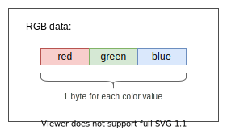

> Copyright 2021 Skyfighter64
>
>   Licensed under the Apache License, Version 2.0 (the "License");
   you may not use this file except in compliance with the License.
   You may obtain a copy of the License at
>
>       http://www.apache.org/licenses/LICENSE-2.0
>
>   Unless required by applicable law or agreed to in writing, software
   distributed under the License is distributed on an "AS IS" BASIS,
   WITHOUT WARRANTIES OR CONDITIONS OF ANY KIND, either express or implied.
   See the License for the specific language governing permissions and
   limitations under the License.

--------------------------------------------------------------------------------
en-us

# ALUP - Arduino LED USB Protocol (name may change)

__Version: 0.1 (internal)__

## Description

The ALUP (Arduino LED USB Protocol, name may change) is a protocol for transmission of RGB data.
It can be used to let almost any device control addressable LED strips.

This document defines the protocol itself.
If you just want to use it, see:
[ALUP Implementations](#Implementations_link) and [Projects using ALUP](#Projects_link).

## Table of contents
- TODO:
- add
- me

## Overview

Overview Example

You need two devices:
- A master device
  - Needs a way to communicate with the slave device
  - Doesn't need to be able to control addressable LEDS natively
  - Examples: PC, Smartphone.

- A slave device
  - Needs a way to communicate with the master device
  - Can control addressable LEDs
  - Examples: Arduino Microcontroller, ESP8266.

#### Example Usecase:
The master device want's to control addressable LED strips, but can't because it has no way to connect to the LEDs directly, like GPIO pins, whereas the slave device
has this connectivity, but lacks other features or performance which are needed.

This is where this protocol comes in.

The ALUP describes a way how the RGB data gets from the PC (master device) to the Microcontroller (slave device) over any kind of connection like USB or Wi-Fi, which then can apply the RGB values to the LEDs. This makes it possible for the PC to control the addressable LEDs indirectly.    

[Fig. 1_en] (two devices connected to each other over a wired connection along with connected LEDs to the slave device)

## Features
- __Flexible:__ Almost any connection such as USB or Wi-Fi can be used.

- __Customizable:__ Programs can add custom configuration values and trigger pre-written scripts on the slave device.

## Requirements
A list of requirements for the protocol.

#### Hardware requirements:
The **protocol** has the following hardware requirements:

- Master device
    - e.g. a Windows PC

- Slave device
    - Has to be able to control addressable LEDs
    - e.g. Arduino, ESP32, ...

- Connection between devices
    - e.g. USB, UART, Wi-Fi, Bluetooth etc.

#### Connection Requirements:
There are no strict requirements for the connection type used.

It has built in congestion control, but no checks for package loss. Therefore, any used connection has to be reliable.

## Definitions
This section gives a list of all special terms used within this protocol to better understand this document.

 __Term__ | Example | Description
 -----|---------|-------------
 __RGB data__ | `R:255, B:123, G:0` | One or multiple triplets of 8bit color values, represented in the RGB format. For more, see [RGB Data](#RGB_Data_link)
 __Master Device__ | PC, Smartphone | The device which sends __RGB data__ to the __slave device__
 __Slave Device__ | Arduino, ESP8266 | The device which receives the __RGB data__ from the __master device__ and applies it to the LEDs.
 __(Physical) Connection__ | USB, Wi-Fi  | The physical connection between the __master device__ and the __slave device__ (This includes the entire protocol stack for data transmission).
  |  |
 __Frame__ | - | A set of data which gets sent from the __master device__ to the __slave device__. Consists of a __frame header__  and a __frame body__. For more, see [Frame](#Frame_link).
 __Frame Header__ | - | The part of the __frame__ containing special information. For more, see [Frame](#Frame_link).
 __Frame Body__ | - | The part of the __frame__ which contains __RGB data__. For more, see [Frame](#Frame_link).
  |  |
 __Command__ | - | Can be sent with every __frame__ in its __frame header__. Can be either a __protocol command__ or a __subcommand__.
 __Subcommand__ | - | A __command__ which tells the __slave device__ to execute a custom predefined __subprogram__. See [Subprograms](#Subprograms_link).
 __Protocol Command__ | - | A special type of __command__ which tells the __slave device__ to execute a protocol-defined task. For more, see [Protocol Commands](#Protocol_Commands_link).
 __Subprogram__ | - | Custom, Predefined code which gets executed when a specific __subcommand__ gets received. Each subprogram has its own __subcommand__. For more, see [Subprograms](#Subprograms_link).

## Protocol Workflow
This section states how the protocol works in detail by explaining what each device does during each
of the 3 processes. Those processes are:

- [Connecting](#Connecting_link)
- [Data Transmission](#Data_Transmission_link)
- [Disconnecting](#Disconnecting_link)

### Protocol Flow Overview:
A quick overview of the protocol workflow.
When two devices get connected via the physical connection, they first establish a connection and share some important
configuration data like how many LEDs are connected to the slave device.

If this happened successfully, the master device sends data frames for the LEDs until it disconnects, or the physical connection is interrupted.

:information_source: General Note: all timeout values (unless stated explicitly) are defined by the protocol implementation itself. If implementing this protocol, it is advised to use a timeout of multiple seconds for the best results.

### Connecting

Before sending any [RGB data](#RGB_Data_link), both devices need to be connected and configured. This connection process consists of 3 Steps:
- [Requesting a connection](#Requesting_A_Connection_link)
- [Exchanging configuration data](#Exchanging_The_Configuration_link)
- [Confirming the configuration data](#Confirming_The_Configuration_link)

[Fig. 2_en] (Overview of the connection process)

----

#### Requesting a connection:

##### Slave Device:
As soon as the physical connection is established,
the slave device begins to send a [connection request byte](#Connection_Request_Byte_link) and listens for a [connection acknowledgement byte](#Connection_Acknowledgement_Byte_link) in fixed intervals.
The interval size can be specified by the implementation itself (recommended: 0.1s).

Sending [connection request bytes](#Connection_Request_Byte_link) and listening for a
[connection acknowledgement byte](#Connection_Acknowledgement_Byte_link) will not time out and continue indefinitely until a [connection acknowledgement byte](#Connection_Acknowledgement_Byte_link) is received.

[Fig. 2_1_en] (Slave device sending a connection request to the master device and waiting for connection acknowledgement)

##### Master Device:
The master device starts by listening for a single Byte of data containing a [connection request byte](#Connection_Request_Byte_link). When receiving a [connection request byte](#Connection_Request_Byte_link), the master device prepares to receive the
[Configuration](#Configuration_Format_link) next and sends a [connection acknowledgement byte](#Connection_Acknowledgement_Byte_link) back to the slave device as soon as it is ready to
receive the configuration.

Listening for a connection request byte [connection request byte](#Connection_Request_Byte_link) may time out, but can also continue until one was received. This behavior can be specified by the implementation of the Master Device.

[Fig. 3_en] (Master device sending a connection acknowledgement byte to the Slave device)

----
#### Exchanging the configuration:

##### Slave Device:
When receiving the [connection acknowledgement](#Connection_Acknowledgement_Byte_link), the slave device stops sending [connection request bytes](#Connection_Request_Byte_link) and listening for [connection acknowledgements](#Connection_Acknowledgement_Byte_link).

It sends the configuration in the defined [Configuration Format](#Configuration_Format_link) and waits for either a [configuration acknowledgement byte](#Configuration_Acknowledgement_Byte_link) or a  [configuration error byte](#Configuration_Error_Byte_link).

[Fig. 4_en] (Slave sending configuration to master )

##### Master Device:
After sending the connection acknowledgement, the master device starts listening for the  [configuration start byte](#Configuration_Start_Byte_link).\
This byte marks the start of the configuration.

When receiving the start byte, the master device proceeds by reading in the configuration as defined in the [Configuration Format](#Configuration_Format_link).

If there was no configuration start byte received within a certain timeout, the master device assumes that the
connection is dead and aborts the connection process.

When receiving the configuration, the master device initializes everything necessary using the received configuration. As soon as the initialization
is finished it sends an [configuration acknowledgement byte](#Configuration_Acknowledgement_Byte_link), indicating that it applied the configuration successfully.

If the configuration could not be applied, it sends an [configuration error byte](#Configuration_Error_Byte_link) to the Slave device indicating that there was
a problem while applying the configuration. Reasons for sending a [configuration error byte](#Configuration_Error_Byte_link) are:

- incompatible protocol versions
- malformed configuration received
- configuration contains invalid values
- an error occurred while applying the configuration

[Fig. 5_en] (Master applying configuration and sending configuration acknowledgement, slave waiting for configuration acknowledgement )

#### Confirming the configuration:

##### Slave Device:
If a [configuration acknowledgement byte](#Configuration_Acknowledgement_Byte_link) is received, the slave device sends an configuration acknowledgement back indicating that
it is ready to receive Data and moves on to [Data Transmission](#Data_Transmission_link).

If the master device could not apply the configuration, a [configuration error byte](#Configuration_Error_Byte_link) will be received.
In this case, the slave device aborts the "connection" process and
waits for a new connection attempt by starting at the [beginning](#Requesting_A_Connection_link) and sending new connection requests.

If no configuration acknowledgement byte or configuration error byte was received within a certain timeout, the slave device assumes that the
connection is dead and aborts the "connection" process. It then starts at the [beginning](#Requesting_A_Connection_link) by sending new connection requests.

##### Master Device:
After sending a [configuration acknowledgement byte](#Configuration_Acknowledgement_Byte_link) to confirm the configuration, the master device listens for a configuration acknowledgement byte from the slave device.

When the master receives a [configuration acknowledgement byte](#Configuration_Acknowledgement_Byte_link), the connection is established successfully and the
devices are ready to move on to [Data Transmission](#Data_Transmission_link).

[Fig. 2_en] (Overview of the connection process)

----------------------------------------------------------------

### Data transmission:
The following text and images will describe the process of sending and receiving [frames](#Frame_link) on both devices.

The data transmission process has 3 steps:

- [Sending](#Sending_Frames_link)/[Receiving](#Receiving_Frames_link) a frame
- Applying the frame to the LEDs
- Frame Acknowledgement

[Fig. 1_data_en] (Overview of the Data transmission process)

#### Receiving Frames
##### Slave Device:
Receiving frames consists of 4 steps:
- Receiving frame header
- Receiving frame body
- Validating frame body size
- Acknowledging frame

As soon as the Slave device sent its Configuration acknowledgement, it gets ready to receive frames in the [frame format](#Frame_link) by waiting for a [Frame Header](#Frame_Header_link).

Waiting for a header continues indefinitely until a header is received or the underlying connection either disconnects or times out. This means that data transmission never times out on the side of the slave device.

When receiving the fixed-size header, the slave device reads the frame body size from the header and receives the frame body using this size value.

 It then checks the
[Command Byte](#Command_Byte_link) of the header and executes the given command.

In case of the default command `None`, the slave device checks the body size and body offset to be valid.

#### Checking the frame body size:

The frame body consists of byte triplets which represent RGB values, it's length therefore always has to be a multiple of 3.

The slave device checks this for the frame body size value from the header.

If it's not a multiple of 3, the slave device sends a [`frame error byte`](#Frame_Error_Byte_link) to the master device and deletes the received frame body.

If the Frame data is less than or equal to the `number of LEDs * 3`, the Slave device applies the [RGB data](#RGB_Data_link) to the LEDs and sends a
Frame Acknowledgement Byte to the master device to indicate for one, that the data was applied and
it is ready to receive the next Frame, and also indicating that the device was not disconnected.

If the Frame data is more than the (number of LEDs * 3), the Slave Device discards all of the data from this frame body and sends
a Frame Error Byte to the master device.

This has to be done in order to prevent desynchronisation of the data stream, in which case all of the incoming data afterwards would be invalid
and the connection would have to be shut down and reestablished manually.

It now returns to the start of the Data Transmission to receive the next frame. This continues indefinitely until a `disconnect` protocol command
gets received.

#### Applying the frame body:

If the frame body size and frame body offset checks passed, the slave device applies the frame body to the LEDs with the following rules:

  - All LEDs are set to the color as specified in the body in the [RGB format](#RGB_Data_link) if the command is `None` or `Clear` or any other command unless stated otherwise.

  - If there is no color specified for an LED, it shall remain unchanged when the command is `None`. When the command is `Clear`, all non-specified LEDs are set to black (R = 0, G = 0, B = 0).

  - The first LED index is the value of [Frame Body Offset](#Frame_Body_Offset_link). If the first Index exceeds the length of the LED strip, continue without applying LEDs.

  - The last LED index is `Frame Body Offset + (Frame Body Size / 3)`. If the Frame Body data exceeds the length of the LED strip, all exceeding values are ignored.

[Fig. 2_data_en] (Overview of the Data transmission process for the slave device)

-------------------------------

#### Sending Frames
##### Master Device:
As soon as the Master Device receives the Configuration acknowledgement from the Slave Device, it sends [`Data Frames`](#Frame_link) to the Slave Device in undefined intervals.

The [frame header](#Frame_Header_link) and [body](#Frame_Body_link) are constructed as defined considering the following rules:

- All rules stated for applying the frame body when [receiving a frame](#Receiving_Frames_link)

The built frame gets appended at the end of the header and sent to the slave device.

The master device then waits for a [frame acknowledgement](#Frame_Acknowledgement_Byte_link) or [frame error](#Frame_Error_Byte_link)

If a [frame acknowledgement](#Frame_Acknowledgement_Byte_link) or [frame error](#Frame_Error_Byte_link) is received, the next frame can be sent.

While a [frame acknowledgement](#Frame_Acknowledgement_Byte_link) indicates a successful operation, a [frame error](#Frame_Error_Byte_link) indicates an issue with the frame. This can be:

- For `None` and `Clear` commands:
    - The body size is no multiple of 3
- For any other commands, see command definition.

If no [frame acknowledgement](#Frame_Acknowledgement_Byte_link) or [frame error](#Frame_Error_Byte_link) is received within a specified time interval, the connection is considered dead and can be terminated.

[Fig. 2_data_en] (Overview of the Data transmission process for the master device)

----------------------------------------------------------------------------------------------

###  Disconnecting:

##### Master Device:

When the master device wants to disconnect, it sends a frame with a [`disconnect command`](#Protocol_Commands_link) to the Slave Device and then disconnects
his side of the connection by invalidating all connection relevant values and disconnecting all underlying protocols.

##### Slave Device:

Upon receiving a frame with a [`disconnect command`](#Protocol_Commands_link) inside the frame header, the slave device treats the connection as dead, invalidates all connection relevant values, and disconnects the underlying connection on his side if needed. A final [frame acknowledgement](#Frame_Acknowledgement_Byte_link) is sent to confirm the disconnect.

When the slave device wants to initiate disconnecting, it can only do so indirectly by
stopping to respond to frames with frame acknowledgements or frame errors. This causes a time out on the master device.

[Fig. 1_disconnect_en] (Overview of the disconnection process)

-----------------------------------------------------------------

## Definitions

This section contains definitions and constants of the protocol

####  RGB data:
One or multiple sets of 3 bytes representing the R, G and B value for a LED each within a range of 0-255

Byte nr. | Color
:---:|:---:
0 | Red
1 | Green
2 | Blue

//TODO: add byte indexes to the image and delete table

#### Subcommand:
A command with an ID corresponding to a Subprogram sent inside of a Frame Header to execute the Subprogram.
For more information, see [Subprograms](#Subprograms_link).

####Subprogram:
A small Program which gets executed on the Slave device when a Subcommand with its ID gets received
For more information, see [Subprograms](#Subprograms_link).

### Definitions for data transmission:
All mentions of the data types within this documentation refer to the definitions below if not stated otherwise.

:information_source: Note: Those definitions do not apply for the use of an implementation of the protocol, they only do for
sending and receiving data using the protocol (describing in which format data is sent and received).
Therefore they are only relevant if you are writing an implementation of the protocol.

#### String:
A string is a combination of UTF-8 encoded characters followed by a null byte used as terminator.
String data has a dynamic length; The end of a string is marked with a Null byte (0x00) as a terminator.
Therefore: When sending String data, send a Null byte (`0x00`) afterwards if it is not done by the used programming language itself.

:warning: Note: Large Strings can have a significant impact on performance

#### Integer:
An integer number is a 32-bit 2s-compliment number.

#### Long:
A long is a 64bit 2s-compliment number.

#### Short:
A short is a 16bit 2s-compliment number.

#### Byte:
A byte is a 8bit unsigned number ranging from 0 to 255.

:information_source: This is important because:
- while most architectures do use this definition, depending on the board, the architecture of the Arduino may use 16-bit numbers as integer.
Therefore, when you want to send integer data, you may actually have to use variables of the type long (32bit-integer) on the Arduino
and int (32bit-integer) on the master system. At the end, the actual bit length of the types has to match.

- Strings may use a null terminator internally, but when sending strings, the null terminator may be cut off. It is Therefore
important to ensure a null terminator is also sent so the receiving device does know the end of the string.

--------------------------------------------------------------------------------

### Constants:
This section describes constants that are relevant for this protocol

Version:
Value: One of:
        "version 0.1 (internal)"

 Description: A String value containing the protocol version.

__Connection Request Byte:__
Value: 255 (base 10)
Description: Byte value indicating a connection request.
For usage see: [Connecting](#Connecting_link)

__Connection Acknowledgement Byte:__
Value: 254 (base 10)
Description: Byte value for acknowledging a connection request
For usage see: [Connecting](#Connecting_link)

__Configuration Start Byte:__
Value: 253 (base 10)
Description: Byte value indicating the start of the Configuration
For usage see: [Connecting](#Connecting_link)

__Configuration Acknowledgement Byte:__
Value: 252 (base 10)
Description: Byte value indicating that the Configuration was received and applied successfully
For usage see: [Connecting](#Connecting_link)

Configuration Error Byte:
Value: 251 (base 10)
Description: Byte value indicating that the Configuration was not received and applied successfully
  and the connection attempt will be stopped
Causes:
    - Invalid configuration received by the slave device
For usage see: [Connecting](#Connecting_link)

Frame Acknowledgement Byte:
Value: 250 (base 10)
Description: Byte value indicating that a Frame was received and applied successfully
For usage see:
  - [Data Transmission](#Data_Transmission_link)
  - [Frame Header](#Frame_Header_link)
  - [Frame Body](#Frame_Body_link)

Frame Error Byte:
Value: 249 (base 10)
Description: Byte value indicating that a Frame could not be received and applied successfully.
Causes:
  - Invalid [`frame body size`](#Frame_Body_Size_link) received by the slave device
  - Invalid [`frame body offset`](#Frame_Body_Offset_link) received by the slave device

  :information_source: Additional causes are listed in the documentation of each implementation

For usage see:
  - [Data Transmission](#Data_Transmission_link)
  - [Frame Header](#Frame_Header_link)
  - [Frame Body](#Frame_Body_link)

--------------------------------------------------------------------------------

### Configuration Format:
This section describes the format of the configuration which gets exchanged between the devices when connecting.

The configuration has to be in the following format:

Configuration Start Byte (1 byte)
Protocol Version (String, dynamic size)
device name (String, dynamic size)
number of LEDs connected (integer, 32bit);
data pin (integer, 32bit);
clock pin (integer, 32bit);
Extra values (String, dynamic size)

[Fig. 1_docs_configuration_en] (The configuration format for the ALUP v. 0.1)

Configuration Start Byte
  Description: The configuration start byte marks the start of the configuration when sent over any kind of connection.
               It is always followed by the configuration values according to the protocol configuration format.
               For more details see: [Configuration Start Byte](#Configuration_Start_Byte_link)

#### Configuration Values:

Protocol Version
  Type: String (UTF-8)
  Description: the protocol version used by the slave device
  Valid values:
    One of:
      "0.1 (internal)"

Device name
  Type: String (UTF-8)
  Description: A descriptive name of the slave device; Does not have to be unique
  Valid values: Any String value

Number of LEDs connected
  Type: Integer
  Description: The number of LEDs on the connected addressable LED strip
  Valid values: A positive Integer value > 0

Data pin
  Type: Integer
  Description: The digital pin at which the data line of the addressable LED strip is connected
  Valid values: A positive Integer value; Should be a valid Data pin of the connected slave device (e.g. Arduino)

Clock pin
  Type: Integer
  Description: The digital pin at which the clock line of the addressable LED strip is connected.
    If the connected LED strip does not need a clock signal, this value can be ignored and set to 0
  Valid values: A positive Integer value; Should be a valid Data pin of the connected slave device (e.g. Arduino) or 0 if no clock
    signal is needed by the type of connected LED strip

Extra Values
    Type: String (UTF-8)
    Description: A string containing any kind of values; This can be used by any developer to send additional configuration values, but may
    be ignored by the Protocol implementation itself and just passed on to the implementing program or the user itself.
    Valid values: Any String value

--------------------------------------------------------------------------------

### Frame:
A frame or "data frame" consists of 2 parts:
The frame header and the frame body.

[Fig. 1_docs_frame_en] (Frame structure)

Those parts are structured as stated below:

### Frame Header:
The frame header consists of 9 bytes:

[Fig. 2_docs_frame_en] (Frame header structure)

Byte: 0-3
  - Name: Frame body size
  - Type: Integer
  - Description: The size of the upcoming frame body in bytes
  - Valid values:
    - A positive Number or 0; Has to be a multiple of 3 as the data of the upcoming body is [RGB data](#RGB_Data_link).
      It therefore also has to be <= [`number of LEDs * 3`](#Number_Of_Leds_link) (as specified in the exchanged [configuration](#Configuration_Values_link)).

    - 0 when there is no body (e.g. when the [command](#Command_Byte_link) is [`disconnect`](#Protocol_Commands_link)).

    :warning: Causes a frame error byte to be sent if invalid.

Byte 4-7
  - Name: Frame body offset
  - Type: Integer
  - Description: The offset of the first LED for the data inside the frame body used when applying the frame
  - Valid values: A positive number or 0; Has to be < [`number of LEDs`](#Number_Of_Leds_link).

    :warning: The frame body offset + frame body length /3 should never exceed the [number of LEDs](#Number_Of_Leds_link).

    :warning: Causes a frame error byte to be sent if invalid.

Byte: 8
  - Name: Command
  - Type: Byte
  - Description: A byte value specifying a command to be executed before the upcoming [RGB data](#RGB_Data_link) gets applied. They are split into 2 different categories: Protocol commands and Subcommands.
    - Protocol commands are commands defined by the protocol to fulfill special tasks.
    - Subcommands are commands that execute small, user defined programs on the slave device.
  To implement your own subprograms and more, see [Subprograms](#Subprograms_link)

  Valid values: Any byte value (0-255)

  __Commands:__
    - 

      __Protocol commands:__
      Decimal value | Name | Description
      :---: | --- | ---
      0 | "None" | This is the default command. Command stating that the [frame body](#Frame_Body_link) should be applied to the LEDs. Unset LEDs will remain unchanged.
      1 | "Clear" | Command setting all LED values to 0 before applying the [frame body](#Frame_Body_link). If the [frame body](#Frame_Body_link) is empty, all LEDs get set to black, if the body contains [RGB data](#RGB_Data_link), all unset LEDs get set to black.
      2 | "Disconnect" |  Command telling the slave device to [disconnect](#Disconnecting_link)
      3 - 7 | [RESERVED] | Protocol command values reserved for future use.

    - 
      __Subcommands:__
      Decimal value | Name | Description
      :---: | --- | ---
      8 - 255 | - | Commands executing the [subprogram](#Subprograms_link) with the corresponding ID on the slave device. The ID is the corresponding value subtracted by an offset of 8. Therefore, a value of 8 executes the subprogram with the ID 0, a Value of 9 executes the subprogram with the ID 1, etc. For adding your own subprograms, see [Subprograms](#Subprograms_link).

### Frame Body:
The frame body consists of the amount of bytes specified in the [`Frame Body size`](#Frame_Body_Size_link) each representing one R, G or B value of one LED,
starting at the LED with the index 0 up to the LED with an index of (Frame Body size / 3).

[Fig. 3_docs_frame_en] (Frame body structure)

The size of the Body always has to be the Size specified in the Header, otherwise the Data will desynchronize and unexpected behavior will occur
causing the protocol to stop functioning. It therefore has to comply to all specifications stated in the documentation of the [`Frame Body size`](#Frame_Body_Size_link), which state, that the number of bytes always have to be a multiple of 3 and are not allowed to
exceed the [`number of LEDs * 3`](#Number_Of_Leds_link) communicated within the [Connection Process](#Connecting_link). If this is not the case,
a [`Frame Error Byte`](#Frame_Error_Byte_link) will be sent instead of the [`Frame Acknowledgement Byte`](#Frame_Acknowledgement_Byte_link) to
the master device when the frame gets received. For more, see [Data Transmission](#Data_Transmission_link).

## Subprograms
This sections explains subprograms and subcommands.

The protocols supports little subprograms that can be executed whenever a Frame is received by sending a [Subcommand](#Subcommands_link)
with the ID of a Subprogram.

Their goal is to provide a possibility to the end user, a program using the protocol or a protocol implementation itself to
execute small scripts on the slave device whenever a Frame gets received by it.

Those Subprograms have a ID ranging from 0 - 247 (internally represented as 8 - 255, for details see the [Frame Header](#Frame_Header_link) Documentation)
whereas each ID represents a function which can be executed by setting the corresponding ID in the [Command byte](#Command_Byte_link) of the [Frame Header](#Frame_Header_link).
By default, each of those functions is empty (doing nothing when executed).
